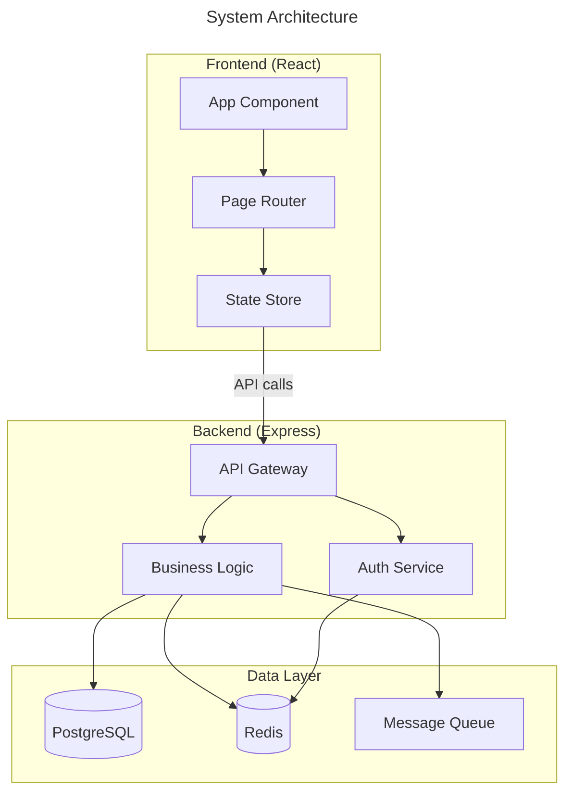
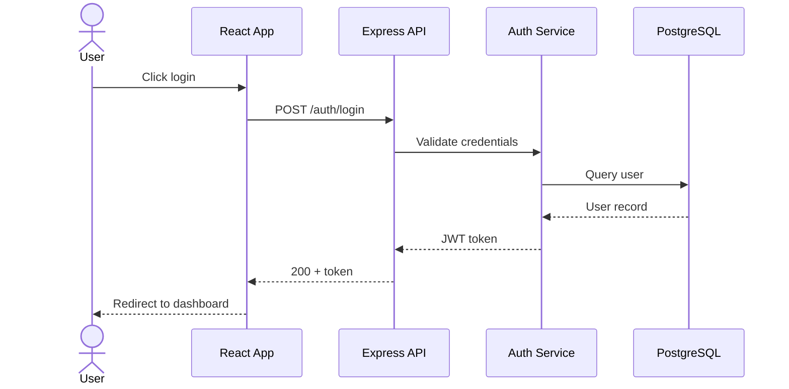
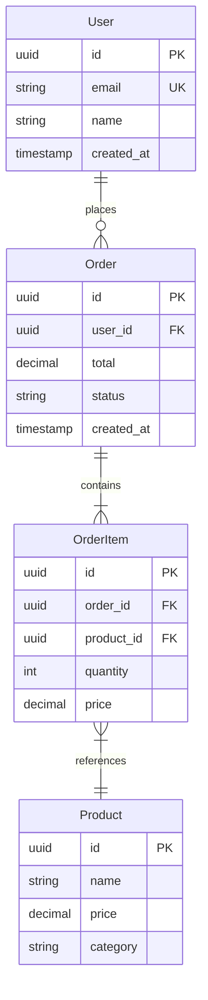
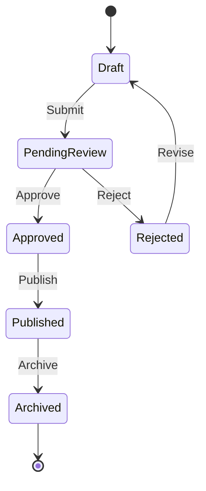
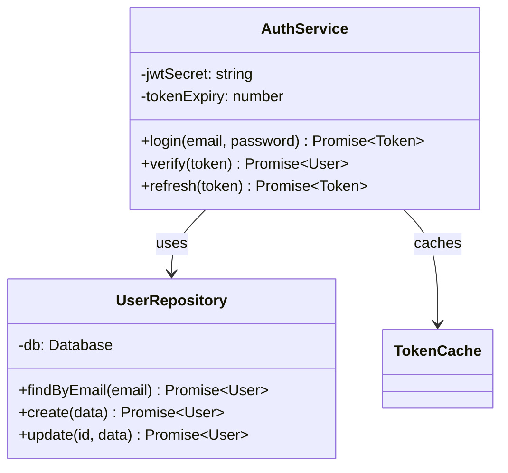
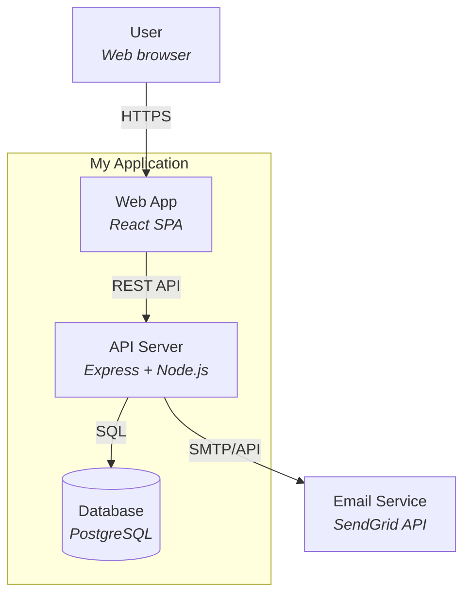
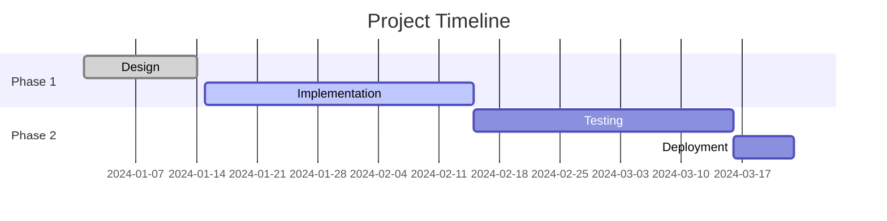
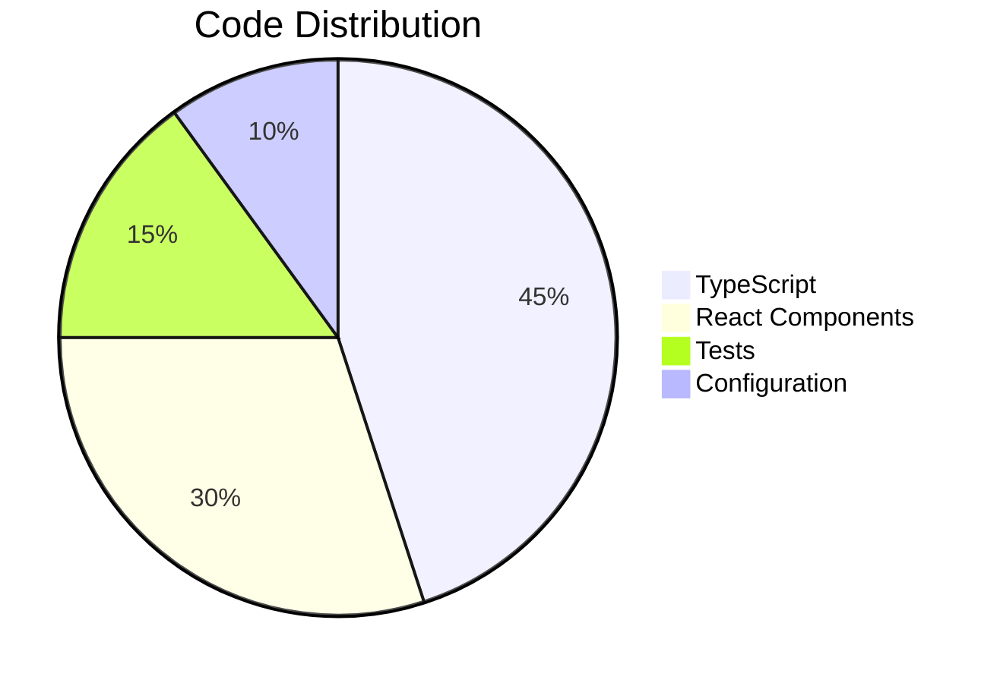

# Mermaid Diagram Patterns

Quick reference for generating correct Mermaid syntax. Always test that the syntax is valid before presenting to the user.

## Flowchart (Architecture / System Overview)



Direction options:
- `TD` or `TB` — top to bottom (best for hierarchies)
- `LR` — left to right (best for flows and pipelines)
- `RL` — right to left
- `BT` — bottom to top

Node shapes:
- `[text]` — rectangle
- `(text)` — rounded rectangle
- `{text}` — diamond (decision)
- `[(text)]` — cylinder (database)
- `([text])` — stadium (terminal)
- `[[text]]` — subroutine
- `>text]` — flag

Edge types:
- `-->` — solid arrow
- `-.->` — dotted arrow
- `==>` — thick arrow
- `-->|label|` — labelled edge
- `--- ` — solid line (no arrow)

## Sequence Diagram



Arrow types:
- `->>` — solid with arrowhead
- `-->>` — dotted with arrowhead
- `-x` — solid with cross
- `--x` — dotted with cross

Features:
- `activate/deactivate` — lifeline activation
- `Note over A,B: text` — spanning note
- `alt/else/end` — conditional
- `loop/end` — repetition
- `par/and/end` — parallel

## Entity-Relationship Diagram



Relationship types:
- `||--||` — one to one
- `||--o{` — one to many (zero or more)
- `||--|{` — one to many (one or more)
- `}o--o{` — many to many

## State Diagram



## Class Diagram (Component Structure)



## C4 Model (using flowchart)

Mermaid doesn't have native C4 support, so use flowcharts with styling:



## Gitgraph

```mermaid
gitgraph
    commit id: "init"
    branch develop
    checkout develop
    commit id: "feat: base setup"
    branch feature/auth
    checkout feature/auth
    commit id: "feat: login"
    commit id: "feat: jwt"
    checkout develop
    merge feature/auth
    branch feature/api
    checkout feature/api
    commit id: "feat: endpoints"
    checkout develop
    merge feature/api
    checkout main
    merge develop tag: "v1.0.0"
```

## Gantt / Timeline



## Pie Chart



## Common Mistakes to Avoid

1. **Special characters in labels** — Wrap in quotes: `A["Label with (parens)"]`
2. **Long labels** — Use `<br/>` for line breaks, not `\n`
3. **Too many nodes** — Split into multiple diagrams if >30 nodes
4. **Single-letter IDs** — Use descriptive: `AuthService` not `A`
5. **Missing direction** — Always specify `graph TD` or `graph LR`
6. **Unlabelled edges** — Add labels to non-obvious connections
7. **Subgraph nesting** — Mermaid supports 1 level of nesting; avoid deeper
8. **Reserved words** — `end`, `graph`, `subgraph` cannot be node IDs; wrap in quotes
